# Evidências de Execução SQL

## 01 - Criação das tabelas

O script `01_create_tables.sql` foi executado com sucesso no PostgreSQL utilizando o DBeaver.

Tabelas criadas:

- users
- products
- orders
- order_items

Evidência:

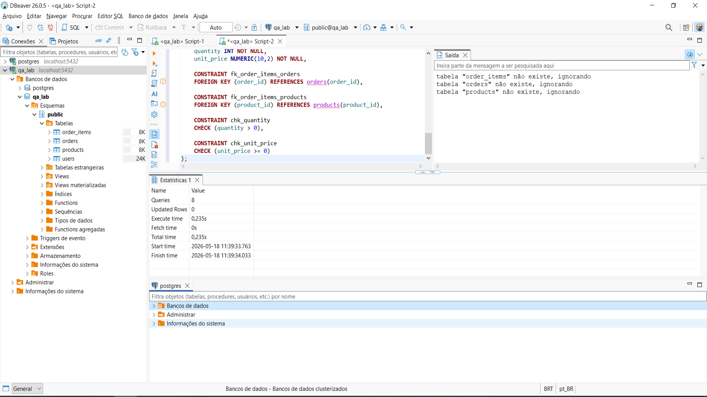  

## 02 - Inserção da massa de dados de teste

O script `02_insert_test_data.sql` foi executado com sucesso no PostgreSQL utilizando o DBeaver.

Foram inseridos dados nas seguintes tabelas:

- users
- products
- orders
- order_items

Total de linhas inseridas:

- 4 usuários
- 5 produtos
- 3 pedidos
- 4 itens de pedido

Total geral: 16 registros inseridos.

Evidência da execução do script:

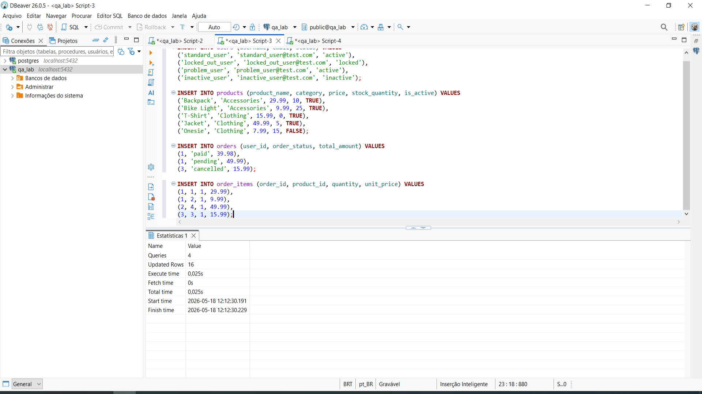

Evidências das validações com SELECT:

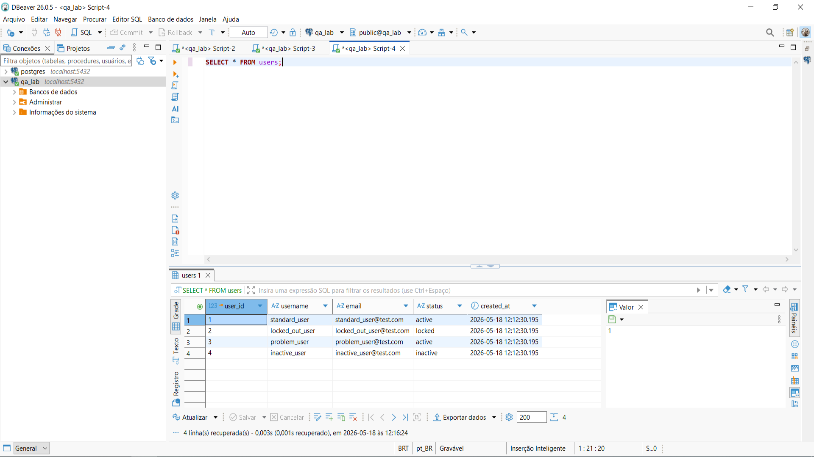

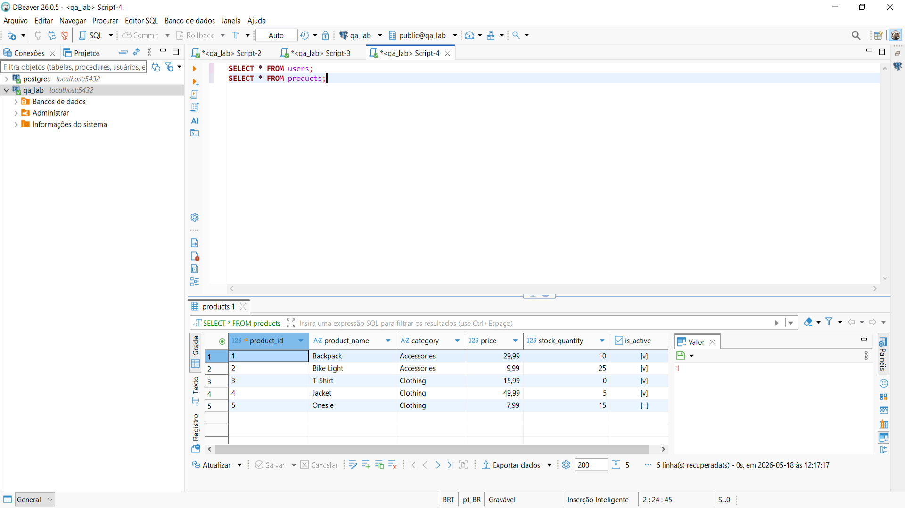

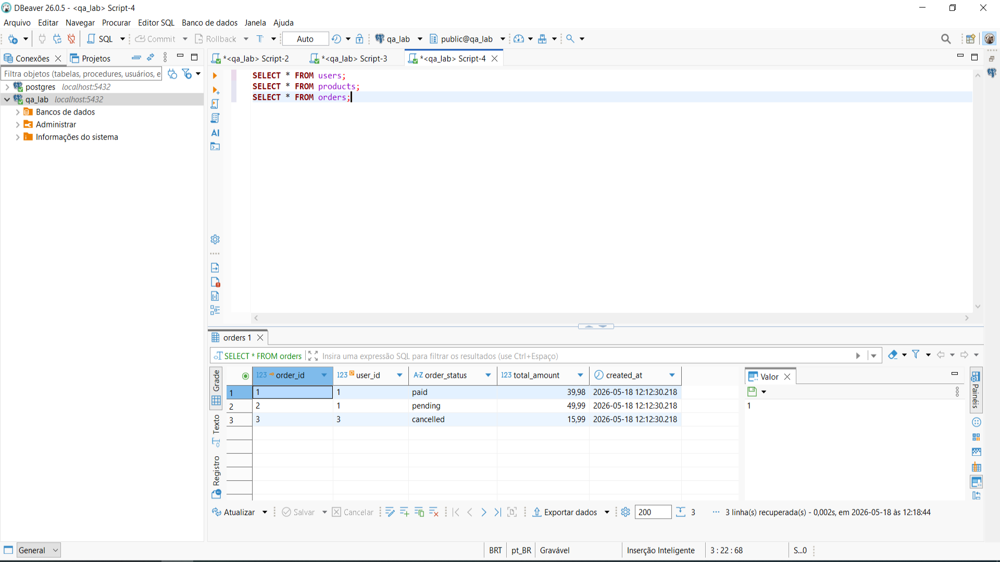

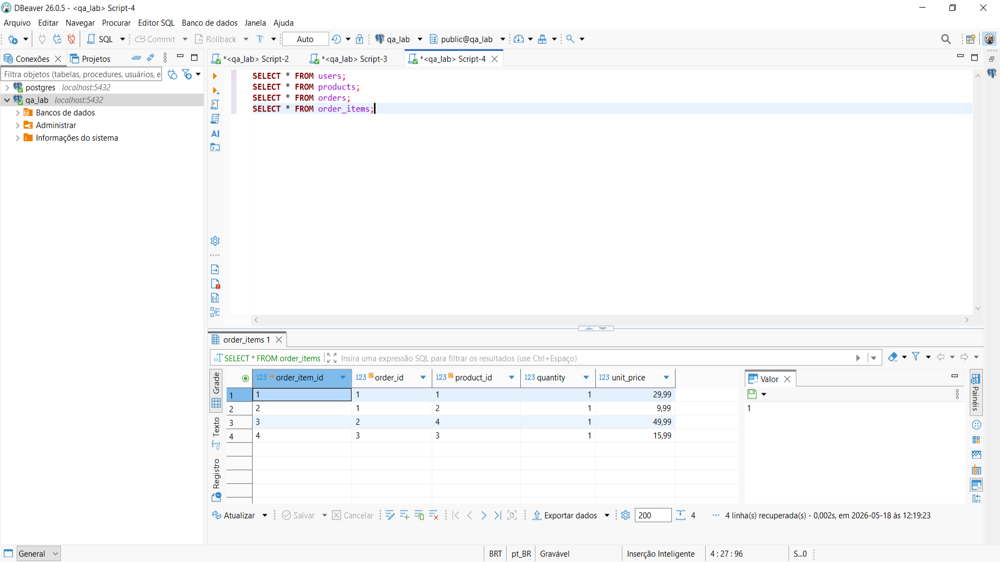  

## 03 - Consultas básicas com SELECT, WHERE e ORDER BY

O script `03_basic_selects.sql` foi criado para validar consultas básicas utilizadas em cenários de QA.

Foram aplicadas consultas para:

- listar usuários, produtos, pedidos e itens de pedido;
- filtrar usuários por status;
- identificar usuários bloqueados;
- identificar produtos sem estoque;
- identificar produtos inativos;
- ordenar produtos por preço;
- consultar pedidos por status.

Evidências:

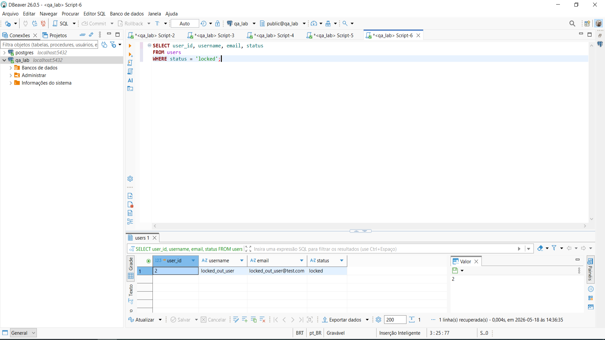

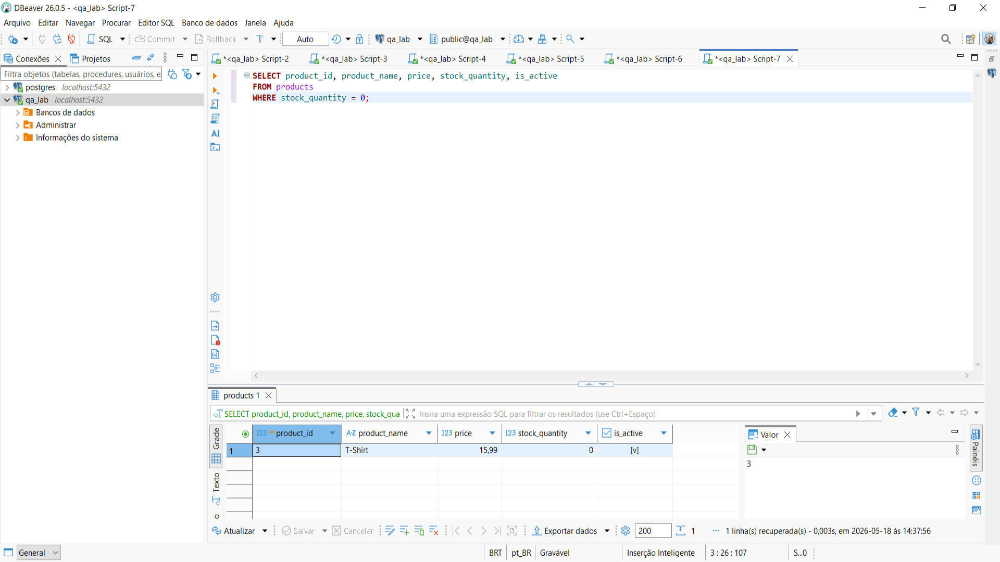

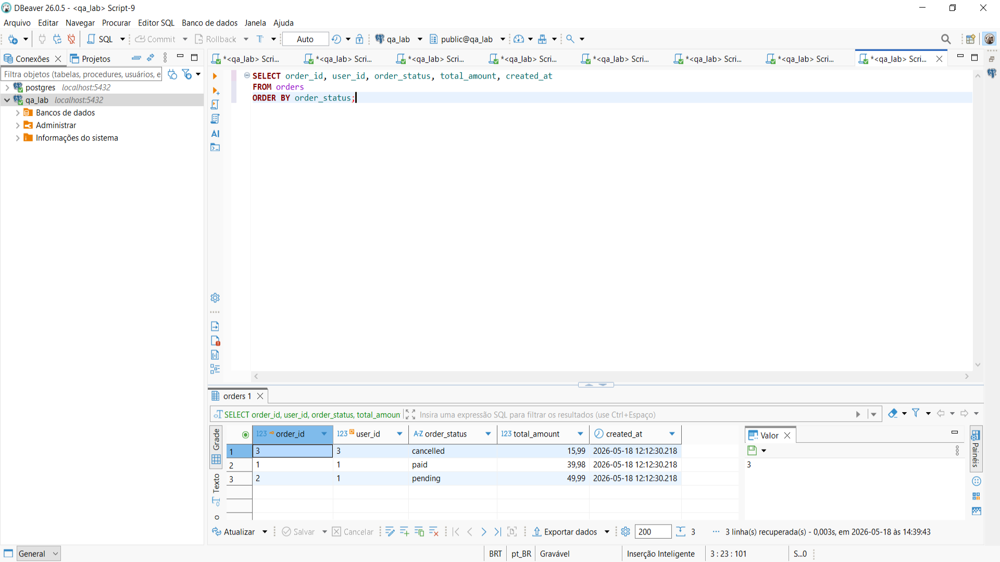  

## 04 - Validações de regras de negócio

O script `04_validation_queries.sql` foi criado para validar possíveis inconsistências de dados em um cenário de e-commerce.

Foram criadas consultas para verificar:

- usuários bloqueados;
- produtos ativos sem estoque;
- produtos inativos;
- pedidos sem itens;
- divergência entre o valor total do pedido e a soma dos itens;
- pedidos vinculados a usuários bloqueados ou inativos;
- produtos inativos vinculados a pedidos;
- produtos sem estoque vinculados a pedidos não cancelados;
- status inválidos;
- valores zerados ou negativos.

### Validação de produto ativo sem estoque

A consulta identifica produtos ativos que possuem estoque igual a zero.

Resultado obtido: foi identificado produto ativo sem estoque.

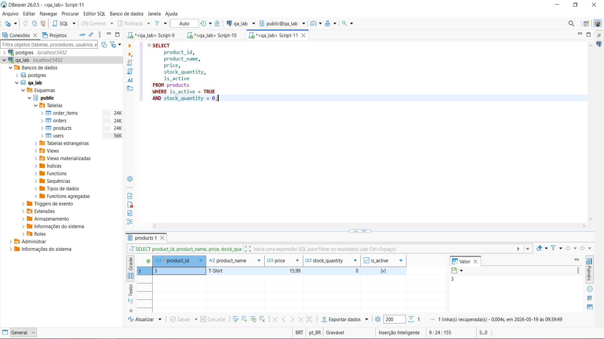

### Validação de consistência do total do pedido

A consulta compara o valor total registrado na tabela `orders` com a soma dos itens registrados na tabela `order_items`.

Resultado obtido: nenhum registro retornado.

Conclusão: não foram identificadas divergências entre o total do pedido e a soma dos itens.

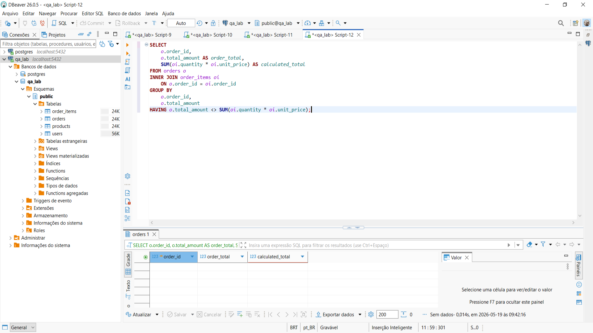

### Validação de pedidos de usuários bloqueados

A consulta verifica se existem pedidos vinculados a usuários com status `locked`.

Resultado obtido: nenhum registro retornado.

Conclusão: não foram identificados pedidos vinculados a usuários bloqueados.

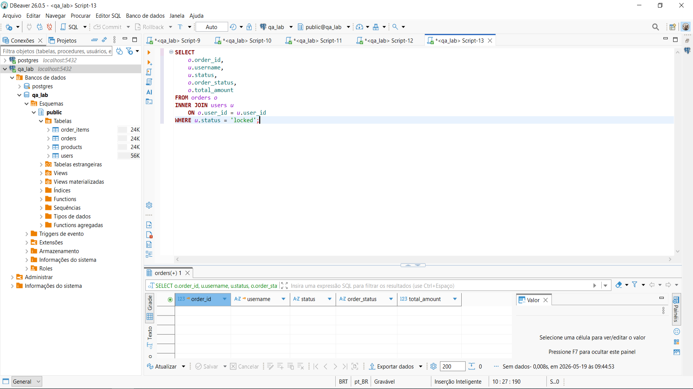

### Validação de status inválido

A consulta verifica se existem pedidos com status diferente dos valores permitidos: `pending`, `paid` ou `cancelled`.

Resultado obtido: nenhum registro retornado.

Conclusão: não foram identificados pedidos com status inválido.

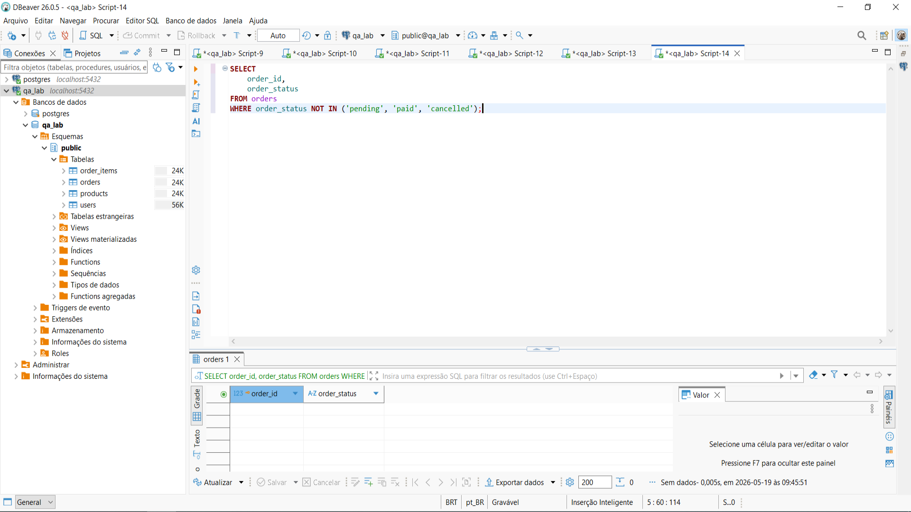  

## 05 - Consultas com JOIN

O script `05_join_queries.sql` foi criado para demonstrar consultas relacionais entre usuários, pedidos, itens de pedido e produtos.

Foram aplicados:

- INNER JOIN entre pedidos e usuários;
- INNER JOIN entre itens de pedido e produtos;
- múltiplos JOINs para visualizar o pedido completo;
- LEFT JOIN para identificar usuários ou pedidos sem relacionamento;
- cálculo do total dos itens por pedido.

Essas consultas simulam validações realizadas por QA para confirmar se as informações exibidas no sistema estão consistentes com os dados gravados no banco.

Evidências:

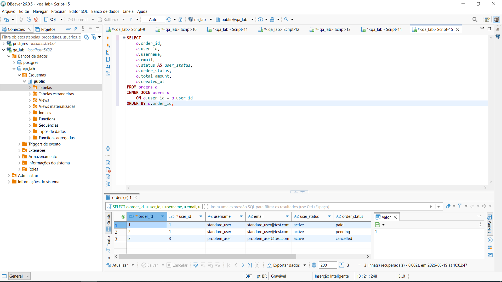

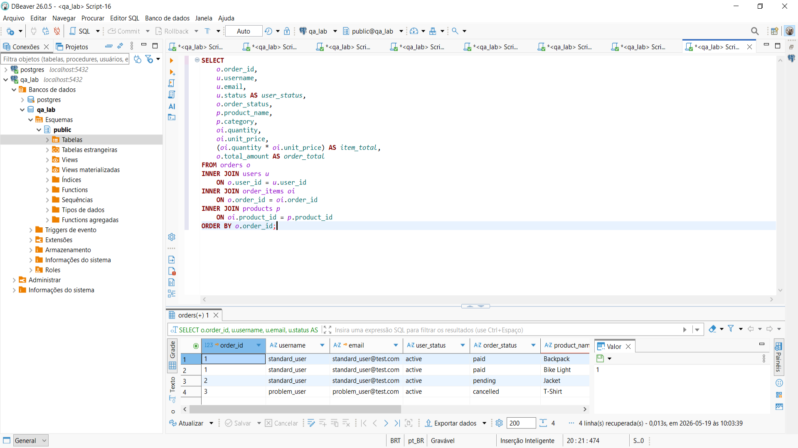

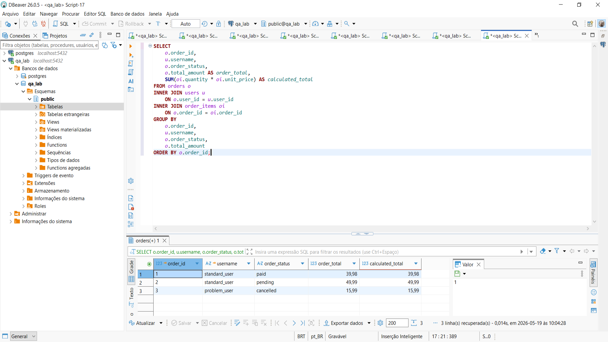  

